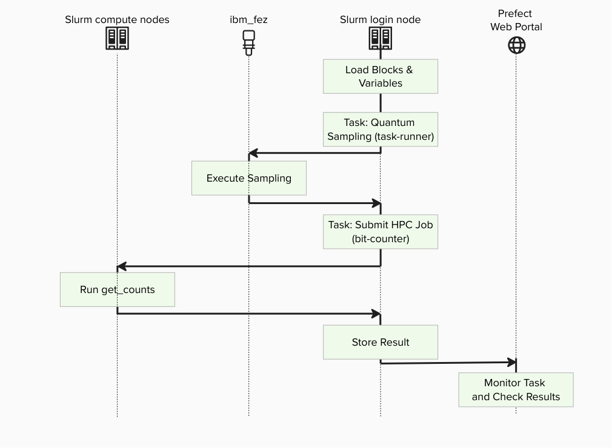
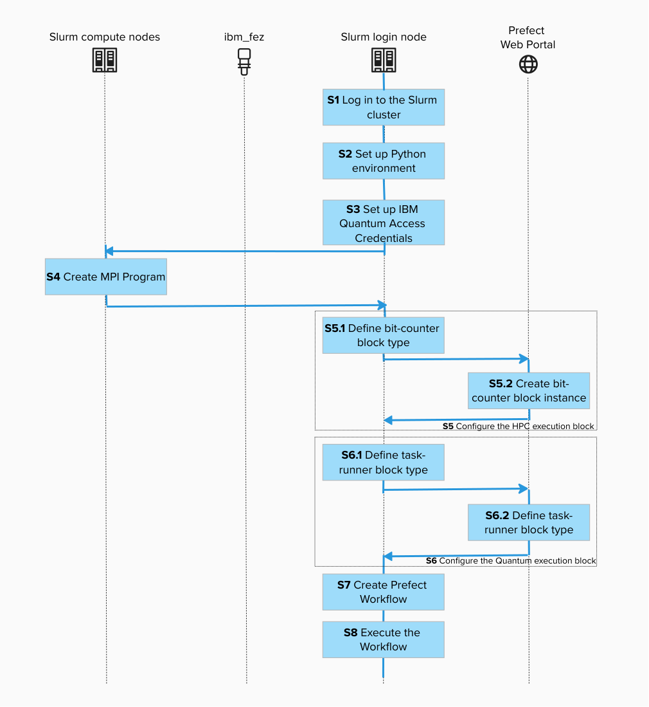
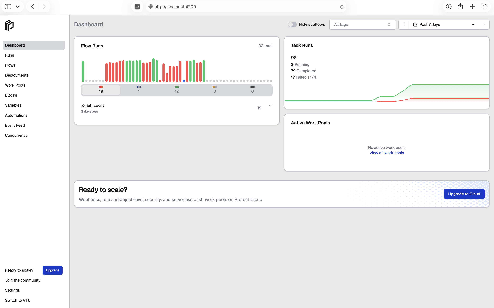
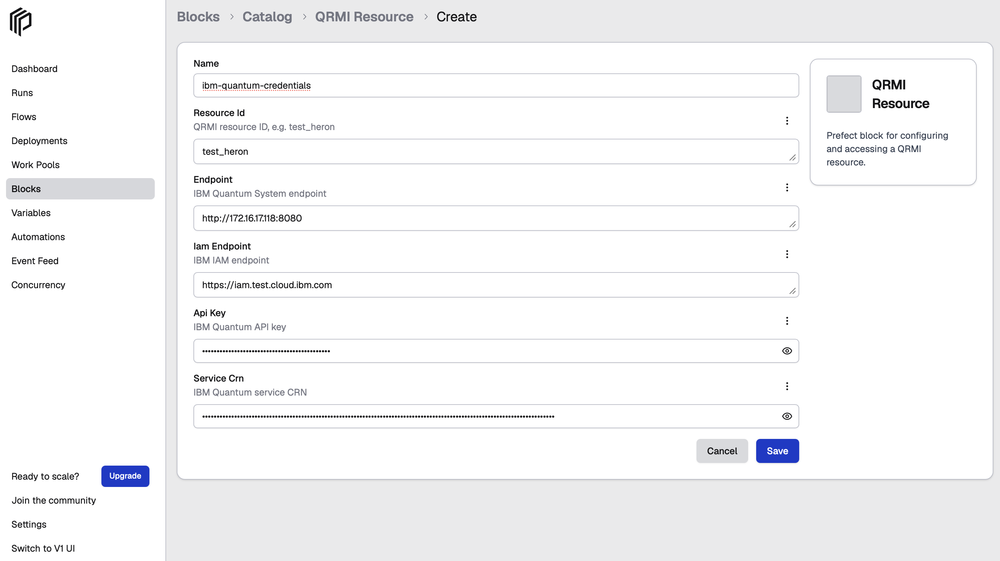
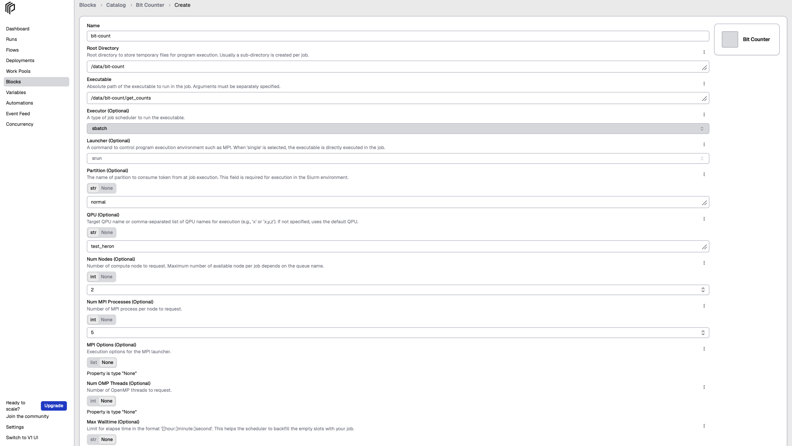
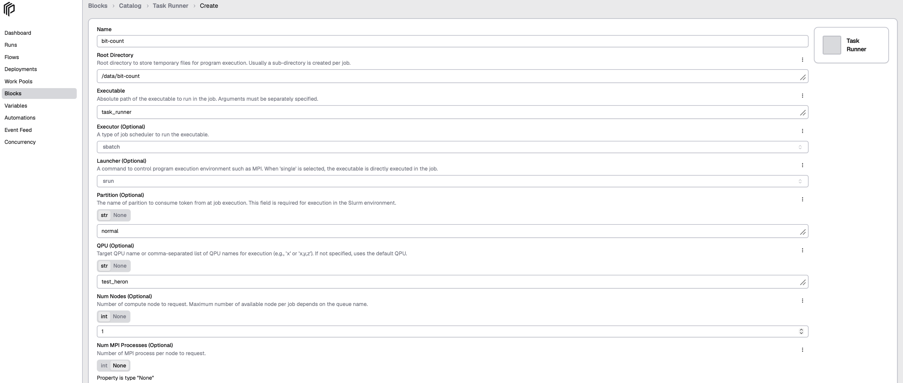
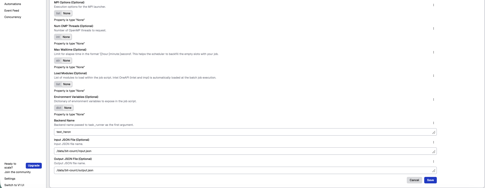
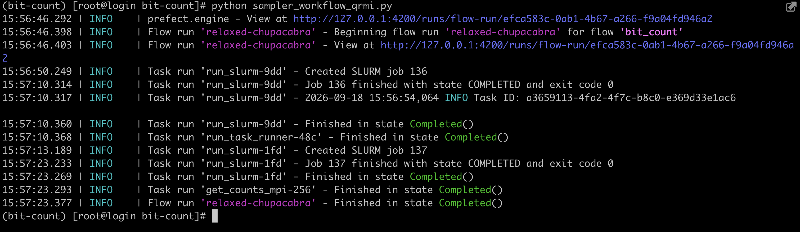
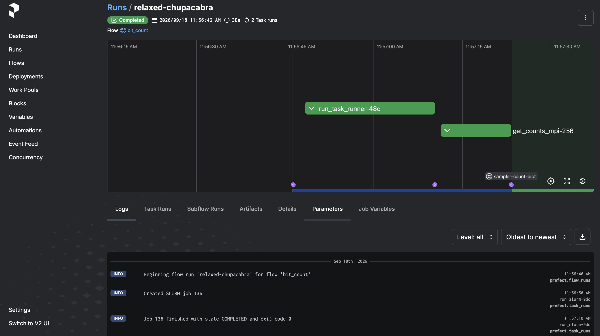
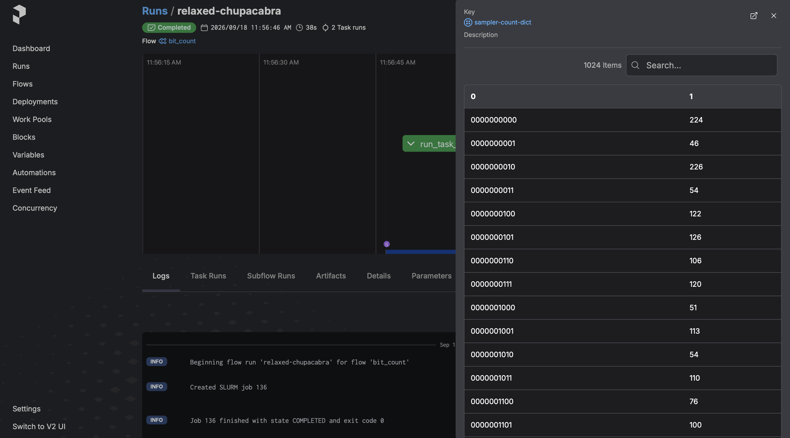

# Create Your QCSC Workflow with Prefect

This hands-on tutorial guides you through building a small C++ program on a Slurm cluster and integrating it into a Prefect workflow using a custom `SlurmJobBlock` class.
On the Prefect workflow, we also use [Prefect Qiskit](https://github.com/qiskit-community/prefect-qiskit) to show how to write a complete QCSC workflow from scratch.

Our objective is to compute a count dictionary of sampler bitstrings using MPI programming on the QCSC architecture.



## Prefect Core Concepts

We will use these terms:
- **Flow**: the end-to-end workflow defined in sampler_workflow_qrmi.py
- **Task**: individual steps inside the flow (e.g., runtime.sampler(...), counter.get(...))
- **Block**: reusable configuration + credentials stored in Prefect server
  - `qrmi-resource` : configuration/abstraction to access a specific quantum resource (QPU)
  - `bit-counter` : HPC job configuration (queue, nodes, executable path, modules)
  - `task-runner`: Quantum job configuration (executable, output) 
- **Variable**: run-time parameter stored server-side (sampler shots etc.)

## Create BitCounts Workflow

## Step 1. Log in to the Slurm Cluster

Connect to the Slurm cluster login node using SSH. This is where we will develop the workflow.

<br>
```bash
ssh login-node@slurm-cluster
```

## Step 2. Set up Python environment

Create a project directory ( our workdir is `/data`):

<br>
```bash
mkdir /data/bit-count && cd /data/bit-count
```

Create a virtual environment and activate:

<br>
```bash
uv venv -p 3.12 && source .venv/bin/activate
```

Install necessary packages:

<br>
```bash
uv pip install prefect-qiskit
uv pip install "git+ssh://git@github.com/shwetasalaria/sca26-qcsc-tutorial.git@main#subdirectory=framework/prefect-slurm"
uv pip install qrmi
```

Check installations:

<br>
```bash
uv pip list | grep -e "prefect" -e "qrmi"
```

You should see output like:

```text
prefect                   3.8.5
prefect-qiskit            0.2.1
prefect-slurm             0.1.0
qrmi                      0.24.4
```

## Step 3. Set up IBM Quantum System Access Credentials

Start the prefect server in background on the login node:

<br>
```bash
prefect server start --background --host 0.0.0.0
```

Make sure the virtual environment is activated:

<br>
```bash
source .venv/bin/activate
```

Create a new Prefect profile:

<br>
```bash
prefect profile create bitcount
```

Prefect server is configured on the login node at port 4200. Set the config as:

<br>
```bash
prefect config set PREFECT_API_URL=http://127.0.0.1:4200/api
```

Note: To access the Prefect UI from your local machine, enable SSH port forwarding when connecting to the login node. For example:

<br>
```bash
ssh -L 4200:localhost:4200 <username>@<login-node>
```
Then open `http://localhost:4200` in your browser. This forwards port 4200 on the login node to port 4200 on your local machine.



Switch to the profile:

<br>
```bash
prefect profile use bitcount
```

Clone repo to run scripts for creating blocks:

<br>
```bash
git clone https://github.com/shwetasalaria/sca26-qcsc-tutorial.git
cd sca26-qcsc-tutorial/framework/prefect-slurm/scripts
```

Register the block schema from a file:

<br>
```bash
prefect block register -f qrmi_resource.py
```

Create `ibm-quantum-credentials` block instance:

<br>
```bash
prefect block create qrmi-resource
```
 
Follow the URL shown to configure the runtime block.
Specify the block name (which we set as `ibm-quantum-credentials`) IBM Quantum backend name and credentials such as endpoint, IAM endpoint, API key and CRN.



Confirm you have access to the blocks you created:

<br>
```bash
prefect block ls
```

Example output:

```
┏━━━━━━━━━━━━━━━━━━━━━━━━━━━━━━━━━━━━━━┳━━━━━━━━━━━━━━━┳━━━━━━━━━━━━━━━━━━━━━━━━━┳━━━━━━━━━━━━━━━━━━━━━━━━━━━━━━━━━━━━━━━┓
┃ ID                                   ┃ Type          ┃ Name                    ┃ Slug                                  ┃
┡━━━━━━━━━━━━━━━━━━━━━━━━━━━━━━━━━━━━━━╇━━━━━━━━━━━━━━━╇━━━━━━━━━━━━━━━━━━━━━━━━━╇━━━━━━━━━━━━━━━━━━━━━━━━━━━━━━━━━━━━━━━┩
│ 97791a8b-ca28-4dca-92a0-eb9ccb50a86d │ QRMI Resource │ ibm-quantum-credentials │ qrmi-resource/ibm-quantum-credentials │
└──────────────────────────────────────┴───────────────┴─────────────────────────┴───────────────────────────────────────┘

```

## Step 4. Compile MPI Program

Make sure you are in the `scripts` directory:

<br>
```bash
pwd
```
Example output:
```text
/data/bit-count/sca26-qcsc-tutorial/framework/prefect-slurm/scripts
```
Check the Open MPI library is loaded in your shell:

<br>
```bash
mpirun --version
```
Make sure that MPI is available on all nodes in the cluster.

Since this program is lightweight, it's fine compiling on the login node:

<br>
```bash
mpicxx -o get_counts get_counts.cpp
```

Check the output file:

<br>
```bash
ls -l
```

Example output:

```text
-rwxr-xr-x 1 root root  49728 Sep 16 02:41 get_counts
-rw-r--r-- 1 root root   1841 Sep 16 02:40 get_counts.cpp
```

Get the absolute path to the `get_counts` executable:

<br>
```bash
realpath ./get_counts
```

Example output:

```text
/data/get_counts
```

We will need this path in the later step.

> [!NOTE]
> `get_counts` reads `input.bin` file including a 32-bit integer vector of bitstrings, splits the data across MPI processes, and counts how often each value appears.
> Each process builds a local histgram from its share of the data.
> MPI then combines all local results into a single global histogram, which rank 0 writes out as `output.json`.

## Step 5. Configure Prefect block for MPI task

### Step 5.1 Prefect Block for MPI task

In this step, we define a Block Type (`bit-counter`) in Python.
This is the template/schema that tells Prefect what fields the block has and how it runs `get_counts` on the cluster.

Make sure that you are in the `scripts` directory

Register the block schema from a file:

<br>
```bash
prefect block register -f get_counts_integration.py
```

### Step 5.2 Create `bit-counter` block instance
In this step, we create a Block Instance (e.g., “bit-count”).
This is your environment-specific configuration, such as queue name, node count, and the executable path.
Create a new configuration for the Bit Counter block:

<br>
```bash
prefect block create bit-counter
```

This command will display a URL to the Prefect console.
Open it in your browser and fill in the following fields:

| Field | Value / Example |
|---|---|
| Block Name | `bit-count` |
| Root Directory | `/data/bit-count` <br> ( The absolute path to the `bit-count` directory) |
| Executable | `/data/bit-count/sca26-qcsc-tutorial/framework/prefect-slurm/scripts/get_counts` <br> (The absolute path to the `get_counts` executable)|
| Executor | `sbatch`|
| Launcher | `srun`|
| Num Nodes | `2` |
| Num MPI Processes | `5` |

The other fields can be left blank.



Now this configuration is stored in the Prefect server and it can be used by many Prefect workflows.


## Step 6 Configure Prefect block for Quantum task

Now we write a Prefect block to run the quantum sampling task:

### Step 6.1 Define `task-runner` block type

In this step, we define a Block Type (`task-runner`) in Python.
This is the template/schema that tells Prefect what fields the block has and how it runs quantum job on quantum computer.

Register the block schema from a file:

<br>
```bash
prefect block register -f get_task_runner.py
```

### Step 6.2 Create `task-runner` block instance

Create a new configuration for the Task Runner block:

<br>
```bash
prefect block create task-runner
```

Fill the fields (input, output, backend, executable) in the browser.

 

This configuration is stored in the Prefect server and it can be used by many Prefect workflows.

## Step 7. Run Prefect Workflow

Make sure the Quantum Runtime block exist:

<br>
```bash
prefect block inspect qrmi-resource/ibm-quantum-credentials
```

The output may look like:

```text

┌───────────────────┬──────────────────────────────────────────────────┐
│ Block Type        │ QRMI Resource                                    │
│ Block id          │ 97791a8b-ca28-4dca-92a0-eb9ccb50a86d             │
├───────────────────┼──────────────────────────────────────────────────┤
│ resource_id       │ test_heron                                       │
│ endpoint          │ http://172.16.17.118:8080                        │
│ iam_endpoint      │ https://iam.test.cloud.ibm.com                   │
│ api_key           │ ********                                         │
│ service_crn       │ ********                                         │
└───────────────────┴──────────────────────────────────────────────────┘
```

Set the sampler options for the IBM Qiskit Runtime API:

<br>
```bash
prefect variable set bit-count '{"options": {"shots": 100000}}' --overwrite
```

Verify the variable:

<br>
```bash
prefect variable inspect bit-count
```

Example output:

```text
Variable(
    id='c28e5b6c-2f5d-4ad7-82de-3e8f61e765d7',
    created=DateTime(2026, 9, 10, 2, 14, 40, 169461,
tzinfo=Timezone('UTC')),
    updated=DateTime(2026, 9, 14, 20, 18, 51, 25000,
tzinfo=Timezone('UTC')),
    name='bit-count',
    value={'options': {'shots': 100000}},
    tags=[]
)
```

To execute the workflow, run the following Python script:

<br>
```bash
python sampler_workflow_qrmi.py
```

We can also monitor the progress on the Prefect console:




Upon successful completion of the workflow, Prefect will generate the following artifacts:

- `sampler-count-dict`: Count dictionary computed by our MPI program.
- `job-metrics`: Performance metrics of IBM primitive execution.
- `slurm-job-metrics`: Performance metrics of Slurm job execution.



See the official [Artifacts](https://docs.prefect.io/v3/concepts/artifacts) guide about Prefect artifacts.

The metrics artifacts are automatically generated by Prefect integration libraries.
This information might be useful to optimize computing resources.

> [!NOTE]
> Note that this example does not significantly benefit from MPI parallel execution,
> as data input and output on the rank 0 process is the dominant performance bottleneck.
> This example is chosen to demonstrate how MPI programs look like.

---
*END OF TUTORIAL*
